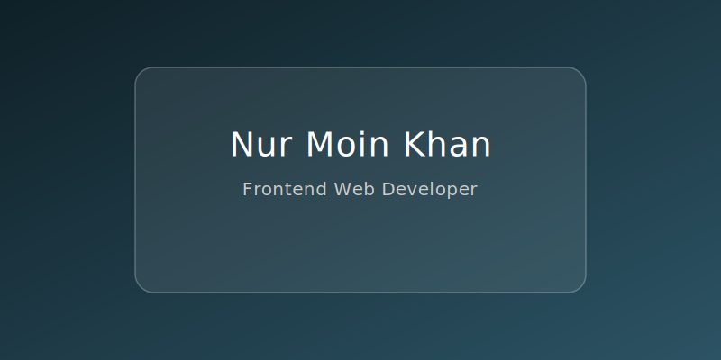

  

<h2 align="center">👋 Hi there, I'm Moin Khan</h2>

   •
   •
   •
   •
  

 

## 👨🏻‍💻 About
I'm a Frontend focused Full-stack web application developer from Bangladesh. I am passion about thinking, writing code, solving problems, fixing bug, searching and building modern web application. I am always enthusiast about learning new technology, topic, concepts from the very core and implement them in project to solve real world problems.

I love to write code. Everyday I try to learn something new. I also share what I learn through blogs. It helps me broaden my knowledge as well as helping others. That's how I love to leave impact.

 

Let’s connect and create something amazing together! 🚀
- 📫 Reach me on  or [@](mailto:nurmoin05@gmail.com)  
- 😄 Pronouns: He/Him

 ## :hammer_and_wrench: Tech Stack

  
<!-- Programming Languages  -->

  

<!-- Framework -->

  

<!-- tools -->

  

 

## ⚡ GitHub Stats

